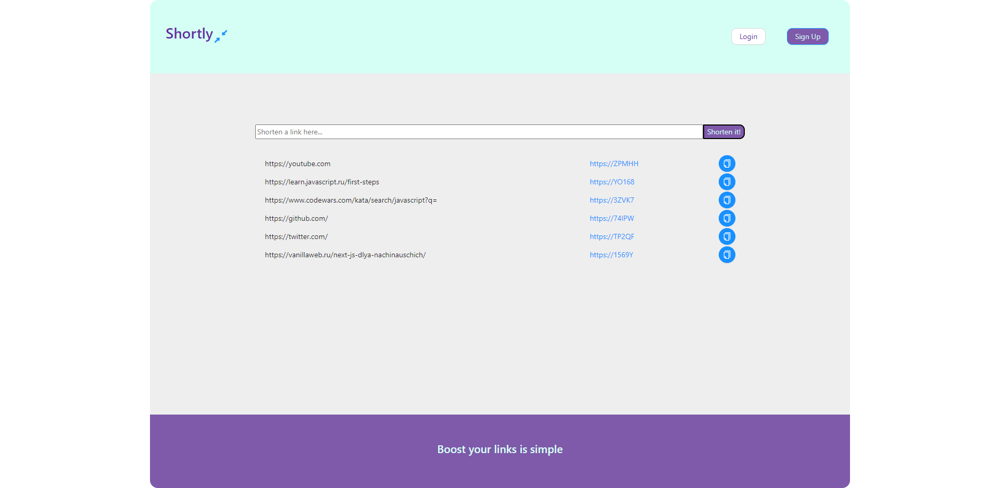
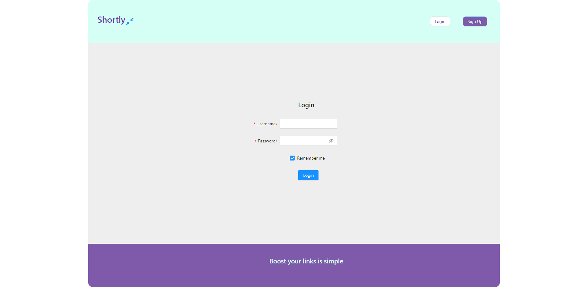
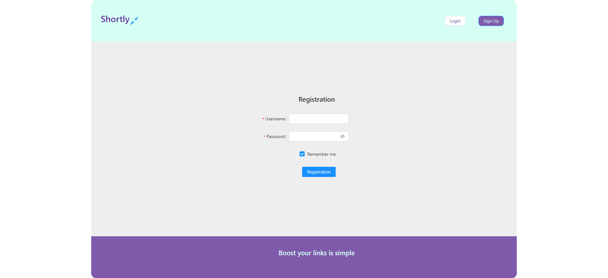
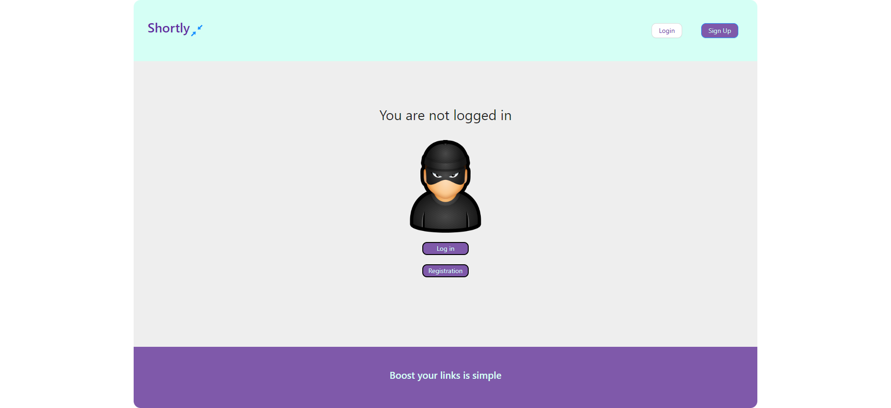

# About the app
Shortly - is your assistant in the matter of shortening links for further sending, for example, to Twitter or SMS, which will reduce the number of characters used, as well as visualize your link to a better view. The application will save all your links after the page is reloaded and you will not have to process them again. By pressing the button after receiving a short link, it will immediately be copied to the buffer, which will allow you to immediately use it for insertion.
To work with the application, you need to register and log in

# Getting Started with Create React App

This project was bootstrapped with [Create React App](https://github.com/facebook/create-react-app).

## Launching the application

In the project directory, you can run:

### `npm install`
### `npm start`

Runs the app in the development mode.\
Open [http://localhost:3000](http://localhost:3000) to view it in your browser.

The page will reload when you make changes.\
You may also see any lint errors in the console.

## Technology stack:
- React
- Redux Toolkit
- Styled-components 
- Ant-design

## Learn More
